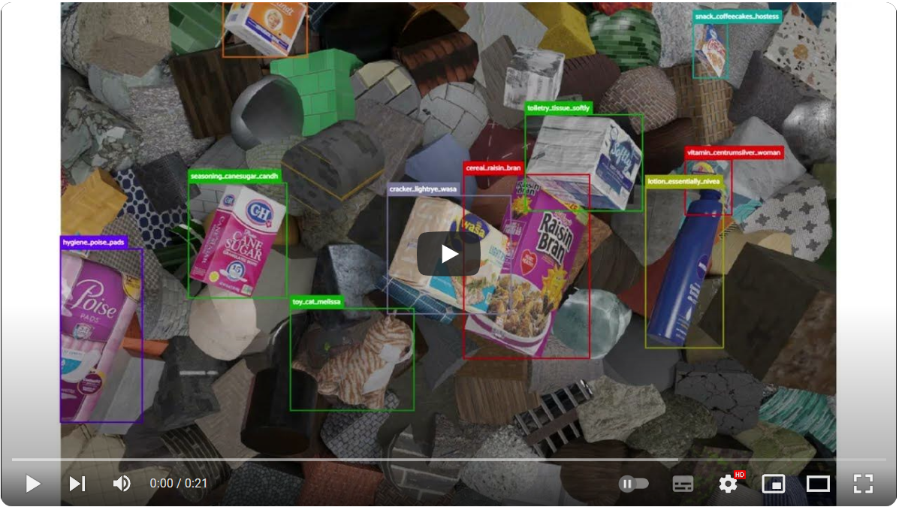
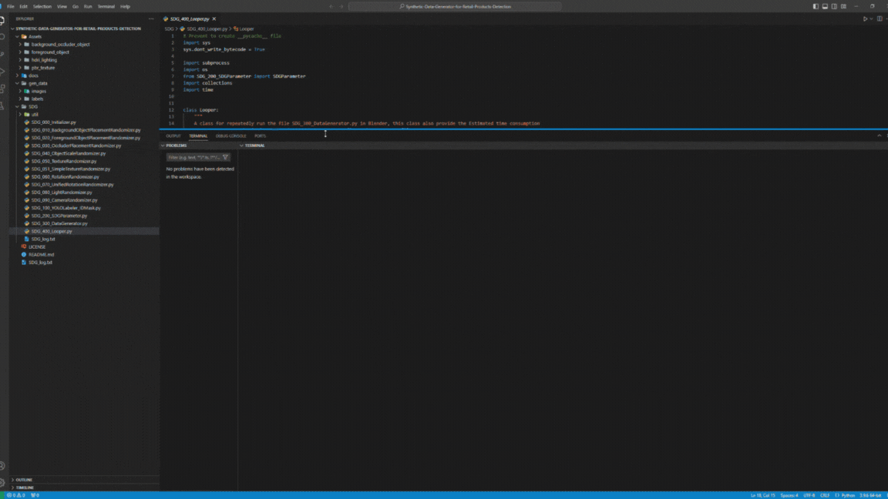
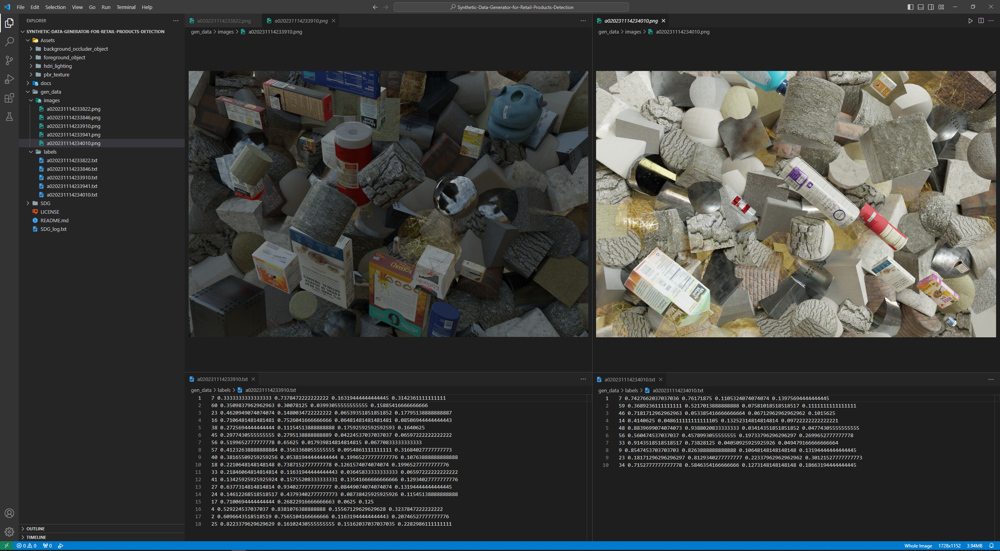

# Synthetic Data Generator for Retail Products Detection
Training convolutional neural network models requires a substantial amount of labeled training data to achieve good performance. However, the collection and annotation of training data is a costly, time-consuming, and error-prone process. One promising approach to overcome this limitation is to use Computer Generated Imagery (CGI) technology to create a virtual environment for generating synthetic data and conducting automatic labeling.

"Synthetic Data Generator for Retail Products Detection" is an open-source project aimed at constructing a synthetic image data generation pipeline using Blender and Python. The generated synthetic data is utilized for training YOLOv5 models and applied to the task of recognizing retail products. This project leverages Blender to produce randomized synthetic images containing 63 types of retail products (e.g., cereal boxes, soda cans, etc.), and exports corresponding data labels and annotations (2D detection boxes in YOLO format).

[](https://youtu.be/BuL7RroTG7s)

## Installation (Windows 10)

#### Step1: Install Blender 3.6 LST
Visit the [Blender 3.6 LTS web page](https://www.blender.org/download/lts/3-6/) and click on the [Windows – Installer](https://www.blender.org/download/release/Blender3.6/blender-3.6.5-windows-x64.msi) link to initiate the download.

#### Step2: Download this repo
Download this repo via git
```
git clone https://github.com/MichaelLiLee/Synthetic-Data-Generator-for-Retail-Products-Detection.git
```
or download via ZIP file.

#### Step3: Download assets

Before using the synthetic data generator to generate data, it is necessary to prepare digital assets for creating virtual scenes.These digital assets include retail product models, background and occluder 3d models, PBR materials, and lighting.

In this project, the required digital assets to be prepared are as follows:

1. 3D models of 63 retail products(.blend file), You can download from this [Google Drive Link](https://drive.google.com/file/d/1nnOdlqenK0gTdRw-_Wlto2il7JkuNLdi/view?usp=sharing).
2. 3D Models with No Texture Serving as background and occluder (.blend file), You can download from this [Google Drive Link](https://drive.google.com/file/d/1ApTrFn1pGWKm97OosuGLx8gsJbc6-Dw8/view?usp=sharing).
3. 10 PBR materials from ambientCG, You can download from this [Google Drive Link](https://drive.google.com/file/d/1dKtK0zv47-Ic_nzYlLgsiyHGkZLweWoQ/view?usp=sharing). You can also download more materials manually from the [AmbientCG](https://ambientcg.com/list?type=Material,Atlas,Decal) website. Alternatively, you can use this [python script](https://github.com/DLR-RM/BlenderProc/blob/main/blenderproc/scripts/download_cc_textures.py) from [BlenderProc](https://github.com/DLR-RM/BlenderProc) to download them.
4. 10 HDRIs from PolyHaven, You can download from this [Google Drive Link](https://drive.google.com/file/d/14Up5S2q7sx8VhN6qxADd1x80r3kTm3VY/view?usp=sharing). You can also download more HDRIs manually from the [PolyHaven](https://polyhaven.com/hdris) website. Alternatively, you can use this [python script](https://github.com/DLR-RM/BlenderProc/blob/main/blenderproc/scripts/download_haven.py) from [BlenderProc](https://github.com/DLR-RM/BlenderProc) to download them.

Once you have downloaded these digital assets, please place the assets in the corresponding folders in the following order:

 retail products(.blend) >> Assets/foreground_object
 background and occluder(.blend) >> Assets/background_occluder_object
 pbr_texture(folders contain a series of jpg images) >> Assets/pbr_texture
 HDRIs(.exr) >> Assets/hdri_lighting

 #### Step4: Setting paths
After completing the aforementioned steps, it is necessary to set several parameters related to the path in the`SDG_200_SDGParameter.py`file:
1. `blender_exe_path` : The path to the blender executable(default: C:/program Files/Blender Foundation/Blender 3.x/blender).
2. `asset_background_object_folder_path` : The path to background object assets(default: Assets/background_occluder_object).
3. `asset_foreground_object_folder_path` : The path to foreground object assets(default: Assets/foreground_object).
4. `asset_ambientCGMaterial_folder_path` : The path to the downloaded ambientCG PBR materials(default: Assets/pbr_texture).
5. `asset_hdri_lighting_folder_path` : The path to the downloaded Poly Haven HDRIs(default: Assets/pbr_texture).
6. `asset_occluder_folder_path` : The path to occlusion object assets(default: Assets/background_occluder_object).
7. `output_img_path` : The path where rendered images will be saved(default: gen_data/images).
8. `output_label_path` : The path where YOLO format bounding box annotations will be saved(default: gen_data/labels).


#### Step5: Test installation was successful - Run SDG to generate synthetic data
After completing the paths settings, execute the `SDG_400_Looper.py` file in vscode.


When rendering images and generating data labels, image and label files will be generated in the`gen_data`folder. 


## Usage

#### 1.Setting parameters in `SDG_200_SDGParameter.py`

This python file contains a configuration class to configure this blender-based synthetic data generator pipeline, The following parameters can be adapted to your specific application.

<table>
    <tr>
        <th>Category</th>
        <th>Parameter</th>
        <th>Description</th>
        <th>Distribution</th>
    </tr>
    <tr><td align="center" rowspan="1">Dataset size</td><td>gen_num</td><td>The quantity of synthetic images needed to be generated.</td><td>Constant(10)</td></tr>
    <tr><td align="center" rowspan="15">3D Object</td><td>asset_background_object_folder_path</td><td>A set of 3D models containing various simple geometric shapes such as cubes and cylinders.</td><td>A set of 3d model assets(10)</td></tr>
    <td>background_poisson_disk_sampling_radius</td><td>Background objects separation distance.</td><td>Constant(0.2)</td></tr>
    <td>bg_obj_scale_ratio_range</td><td>The distribution of the scale ratio of background objects within the blender scene.</td><td>Constant(2.5)</td></tr>
    <td>asset_occluder_folder_path</td><td>A set of 3D models containing various simple geometric shapes such as cubes and cylinders.</td><td>A set of 3d model assets(10)</td></tr>
    <td>occluder_area</td><td>Spatial distribution area of occlusion objects.</td><td>Cartesian[Uniform(-0.6, 0.6), Uniform(-0.4, 0.4), Uniform(1.5, 1.9)]</td></tr>
    <td>occluder_poisson_disk_sampling_radius</td><td>Occlusion objects separation distance.</td><td>Constant(0.25)</td></tr>
    <td>num_occluder_in_scene_range</td><td>The distribution of the number of occlusion objects within the blender scene.</td><td>Uniform(5, 10)</td></tr>
    <td>occluder_scale_ratio_range</td><td>The distribution of the scale ratio of occluder objects within the blender scene.</td><td>Uniform(0.5, 2)</td></tr>
    <td>asset_foreground_object_folder_path</td><td>A set of 63 retail items 3D assets.</td><td>A set of 3d model assets(63)</td></tr>
    <td>foreground_area</td><td>Spatial distribution area of foreground objects.</td><td>Cartesian[Uniform(-1.25, 1.25), Uniform(-0.75, 0.75), Uniform(0.5, 1)]</td></tr>
    <td>foreground_poisson_disk_sampling_radius</td><td>Foreground objects separation distance.</td><td>Constant(0.3)</td></tr>
    <td>num_foreground_object_in_scene_range</td><td>The distribution of the number of retail items within the blender scene.</td><td>Uniform(8, 20)</td></tr>
    <td>fg_obj_scale_ratio_range</td><td>The distribution of the scale ratio of foreground objects within the blender scene.</td><td>Uniform(0.5, 2.2)</td></tr>
    <td>-</td><td>Random rotation angle to background and occluder objects.</td><td>Euler[Uniform(0, 360), Uniform(0, 360), Uniform(0, 360)]</td></tr>
    <td>-</td><td>Random unified rotation angle to all foreground (retail products) objects.</td><td>Euler[Uniform(0, 360), Uniform(0, 360), Uniform(0, 360)]</td></tr>
    <tr><td align="center" rowspan="1">Texture</td><td>asset_ambientCGMaterial_folder_path</td><td>A set of PBR materials that are randomly applied to the surfaces of the background and occluder objects</td><td>A set of PBR texture assets(10)</td></tr>
    <tr><td align="center" rowspan="3">Environment Lighting</td><td>asset_hdri_lighting_folder_path</td><td>A set of high dynamic range images (HDRI) for scene lighting.</td><td>A set of hdri assets(10)</td></tr>
    <tr><td>hdri_lighting_strength_range</td><td>The distribution of the strength factor for the intensity of the HDRI scene light.</td><td>Uniform(0.1, 2.2)</td></tr>
    <tr><td>-</td><td>Randomly rotate HDRI map.</td><td>Euler[Uniform(-30, 120), Uniform(-30, 30), Uniform(0, 360)]</td></tr>
    <tr><td align="center" rowspan="24">Camera & Post-processing</td><td>-</td><td>Perspective Camera focal length value in millimeters.</td><td>Constant(35)</td></tr>
    <tr><td>img_resolution_x</td><td>Number of horizontal pixels in the rendered image.</td><td>Constant(1728)</td></tr>
    <tr><td>img_resolution_y</td><td>Number of vertical pixels in the rendered image.</td><td>Constant(1152)</td></tr>
    <tr><td>max_samples</td><td>Number of samples to render for each pixel.</td><td>Constant(128)</td></tr>
    <tr><td>chromatic_aberration_value_range</td><td>The distribution of the value of Lens Distortion nodes input-Dispersion, which simulates chromatic aberration.</td><td>Uniform(0.1, 1)</td></tr>
    <tr><td>blur_value_range</td><td>The distribution of the value of Blur nodes input-Size, which controls the blur radius values.</td><td>Uniform(2, 4)</td></tr>
    <tr><td>motion_blur_value_range</td><td>The distribution of the value of Vector Blur nodes input-Speed, which controls the direction of motion.</td><td>Uniform(2, 7)</td></tr>
    <tr><td>exposure_value_range</td><td>The distribution of the value of Exposure nodes input-Exposure, which controls the scalar factor to adjust the exposure.</td><td>Uniform(-0.5, 2)</td></tr>
    <tr><td>noise_value_range</td><td>The distribution of the value of brightness of the noise texture.</td><td>Uniform(1.6, 1.8)</td></tr>
    <tr><td>white_balance_value_range</td><td>The distribution of the value of WhiteBalanceNode input-ColorTemperature, which adjust the color temperature.</td><td>Uniform(3500, 9500)</td></tr>
    <tr><td>brightness_value_range</td><td>The distribution of the value of Bright/Contrast nodes input-Bright, which adjust the brightness.</td><td>Uniform(-1, 1)</td></tr>
    <tr><td>contrast_value_range</td><td>The distribution of the value of Bright/Contrast nodes input-Contrast, which adjust the contrast.</td><td>Uniform(-1, 5)</td></tr>
    <tr><td>hue_value_range</td><td>The distribution of the value of Hue Saturation Value nodes input-Hue, which adjust the hue.</td><td>Uniform(0.45, 0.55)</td></tr>
    <tr><td>saturation_value_range</td><td>The distribution of the value of Hue Saturation Value nodes input-Saturation, which adjust the saturation.</td><td>Uniform(0.75, 1.25)</td></tr>
    <tr><td>chromatic_aberration_probability</td><td>Probability of chromatic aberration effect being enabled.</td><td>P(enabled) = 0.1, P(disabled) = 0.9</td></tr>
    <tr><td>blur_probability</td><td>Probability of blur effect being enabled.</td><td>P(enabled) = 0.1, P(disabled) = 0.9</td></tr>
    <tr><td>motion_blur_probability</td><td>Probability of motion blur effect being enabled.</td><td>P(enabled) = 0.1, P(disabled) = 0.9</td></tr>
    <tr><td>exposure_probability</td><td>Probability of exposure adjustment being enabled.</td><td>P(enabled) = 0.15, P(disabled) = 0.85</td></tr>
    <tr><td>noise_probability</td><td>Probability of noise effect being enabled.</td><td>P(enabled) = 0.1, P(disabled) = 0.9</td></tr>
    <tr><td>white_balance_probability</td><td>Probability of white balance adjustment being enabled.</td><td>P(enabled) = 0.15, P(disabled) = 0.85</td></tr>
    <tr><td>brightness_probability</td><td>Probability of brightness adjustment being enabled.</td><td>P(enabled) = 0.15, P(disabled) = 0.85</td></tr>
    <tr><td>contrast_probability</td><td>Probability of contrast adjustment being enabled.</td><td>P(enabled) = 0.15, P(disabled) = 0.85</td></tr>
    <tr><td>hue_probability</td><td>Probability of hue adjustment being enabled.</td><td>P(enabled) = 0.15, P(disabled) = 0.85</td></tr>
    <tr><td>saturation_probability</td><td>Probability of saturation adjustment being enabled.</td><td>P(enabled) = 0.15, P(disabled) = 0.85</td></tr>
</table>

#### 2.Initiate the synthetic data generation loop via `SDG_400_Looper.py`
Once the parameter settings are configured, execute the `SDG_400_Looper.py` file to initiate the synthetic data generation loop.

## Additional resource
**Real Retail Product Image Dataset for validation purpose** : Consisting of 1267 images of real retail products, this dataset originated from the [UnityGroceries-Real Dataset](https://github.com/Unity-Technologies/SynthDet/blob/master/docs/UnityGroceriesReal.md). This project has corrected annotation errors and converted the data labels into YOLO format. The dataset can be downloaded from this [Google Drive link](https://drive.google.com/file/d/1RPFCBf4z7A4NkskV6Jn1MYwirZqf_qtR/view?usp=sharing)."

## Inspiration

This project is inspired by the [Unity SynthDet](https://github.com/Unity-Technologies/SynthDet/tree/master) project, with improvements in methodology (including the addition of PBR materials, HDRI lighting, and ray tracing rendering), and it has been recreated using Blender.

Borkman, Steve, et al. (2021). [*Unity perception: Generate synthetic data for computer vision.* ](https://arxiv.org/abs/2107.04259)
