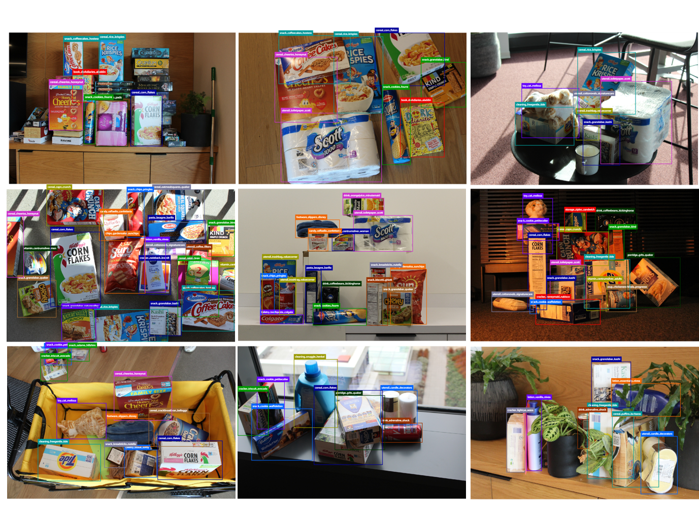
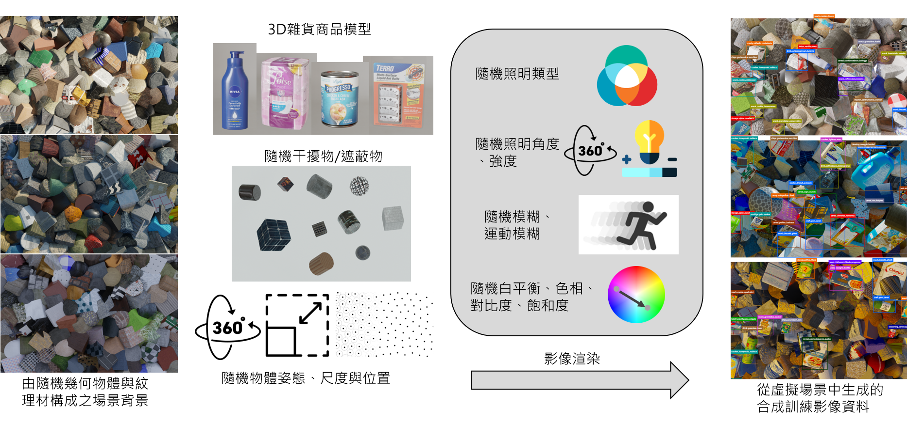
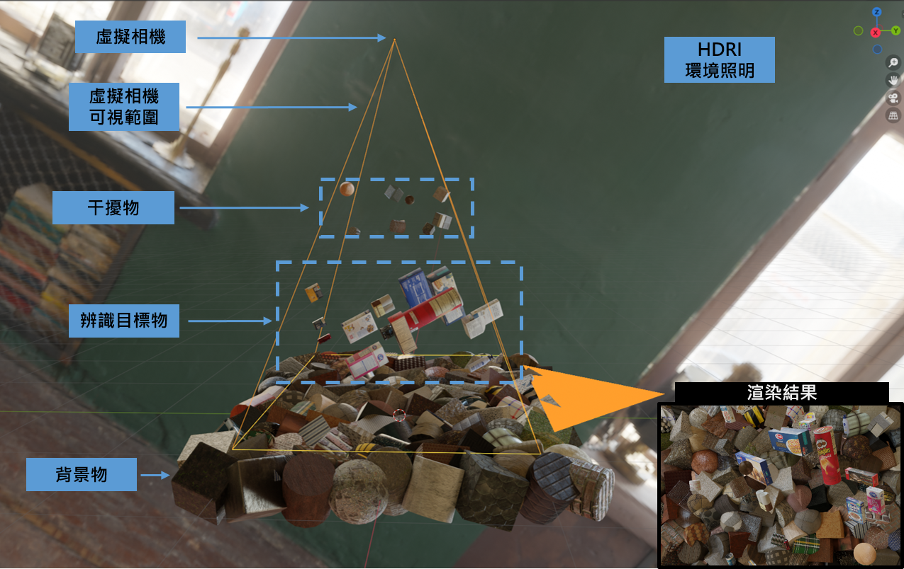
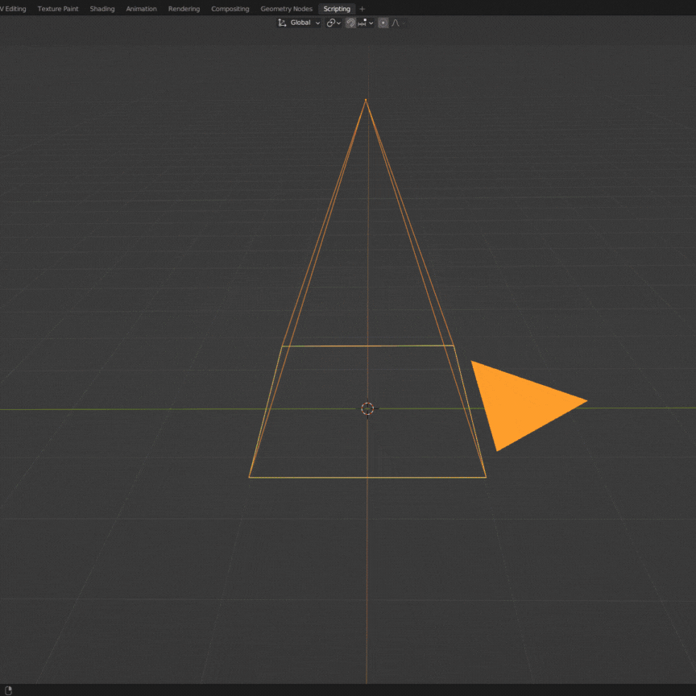
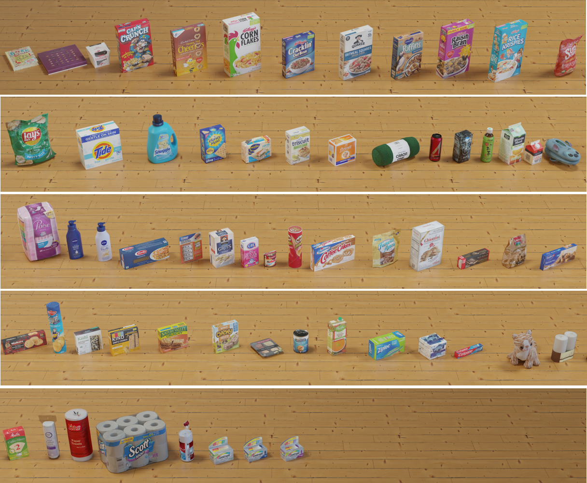
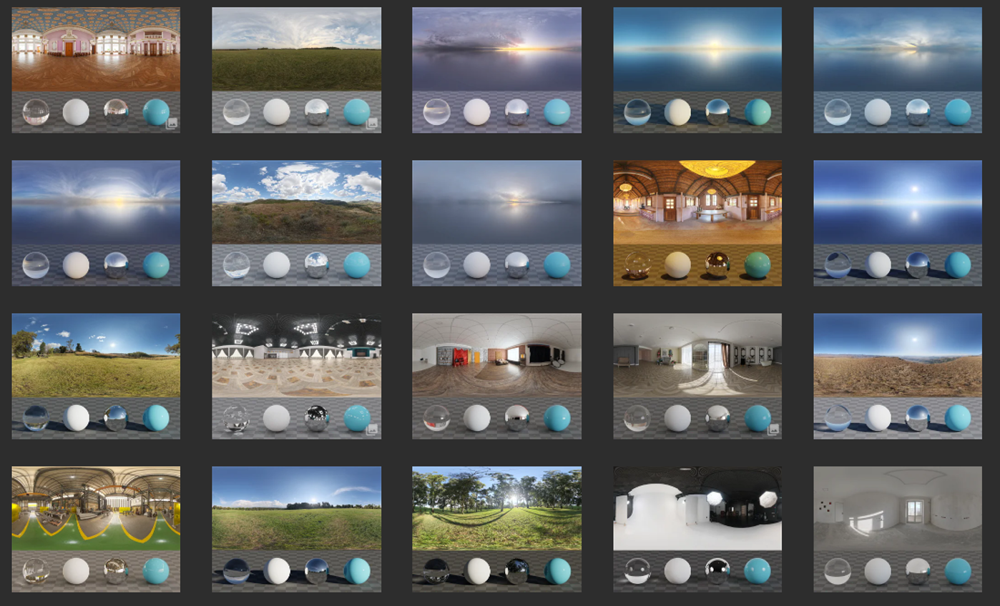
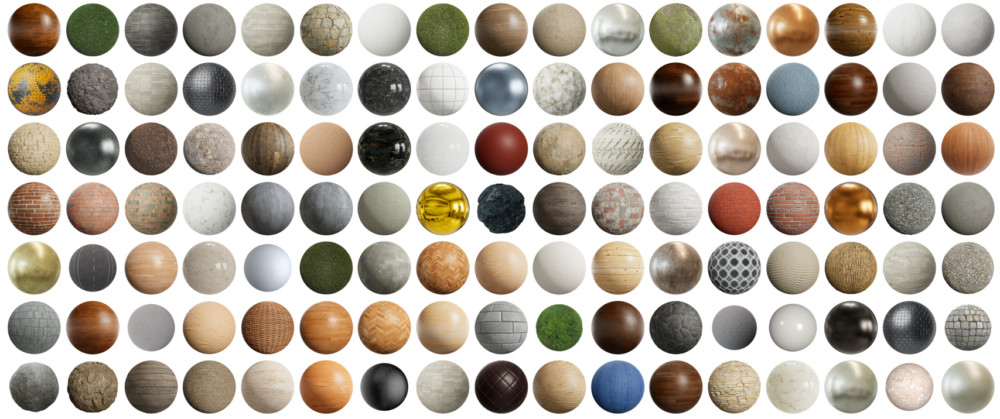
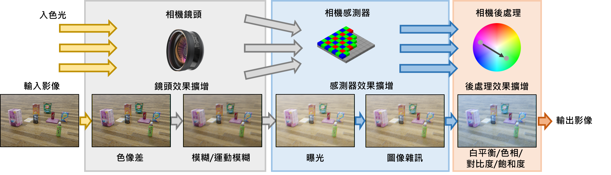
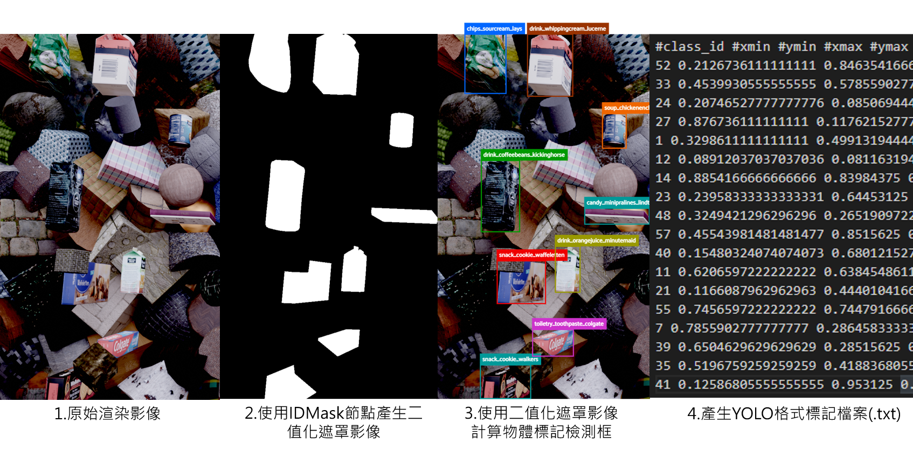

# 應用合成資料訓練物件偵測模型進行零售商品辨識 

訓練卷積神經網絡模型需要大量標記的訓練資料才能獲得良好的性能，而訓練資料的收集和標記是一個昂貴、耗時且容易出錯的過程。克服這一限制的一種有前途的方法是使用電腦合成影像(Computer Generated Imagery, CGI)技術建立一個虛擬環境來生成合成資料與進行自動標記。

## **1. 專案概述** 

Synthetic Data Generator for Retail Products Detection是一個開源專案，旨在以Blender與Python建構一個合成影像資料生成管道，生成的合成資料被用來訓練YOLOv5模型並應用於零售商品(圖 1)辨識用途。此專案利用Blender生成了包含63種零售商品(例如: 麥片盒、可樂鋁罐等)的隨機化合成圖像，並導出對應的資料標籤與標註(2D偵測框，YOLO格式)。

本專案包含了以下資源:
* 數位資產 - 63種零售商品的3D模型(.blend)，可由此[Google Drive]()下載。
* 數位資產 - 1369種PBR材質(.jpg)，這些材質來自ambientCG網站，可由此Google Drive下載。
* 數位資產 - 561種HDRI照明貼圖(.exr)，這些照明貼圖來自PolyHaven網站，可由此Google Drive下載。
* 數位資產 - 充當背景與干擾物的無材質幾何3D模型(.blend)，可由此Google Drive下載。
* 程式碼 - 合成影像資料生成器(SDG)，一個以Blender與Python建構的合成影像資料生成管道。
* 真實零售商品影像資料集 - 1267張真實零售商品影像資料集，此資料集來自UnityGroceries-Real Dataset，其資料標籤為YOLO格式，可由此[Google Drive](https://drive.google.com/file/d/1RPFCBf4z7A4NkskV6Jn1MYwirZqf_qtR/view?usp=sharing)下載。

*圖 1 UnityGroceriesReal Dataset 圖例*

## **2. 合成資料生成管道介紹**
本專案產生合成資料的流程，如圖所示，首先於虛擬場景中生成一面由隨機幾何物體與紋理的背景，接著隨機添加零售商品與干擾/遮蔽物物體至虛擬場景內，並隨機分配物體的姿態與位置，接著向虛擬場景添加隨機照明，並隨機挑選照明的強度、角度，接著隨機產生運動模糊、調整對比度、飽和度等視覺效果，最後渲染影像並產生自動物件標記。

*圖 2 合成資料生成管道的流程*

 

*圖 3、4 於Blender中的虛擬場景*

#### 背景物體生成
虛擬場景的背景產生方式，是從一組包含數種簡單幾何形狀(例如:立方體、圓柱體)的 3D 模型中隨機選取，並填充至虛擬場景的背景，形成一面背景牆。3D 模型的放置位置與彼此間的距離，由給定平面範圍的泊松分布採樣產生，接著隨機旋轉背景物體的姿態。接著設定這些放置於虛擬場景中充當背景物體的表面紋理，表面紋理來自於 1369 種 PBR 紋理材質，隨機選取這些紋理材質中的一個子集並添加至背景物體的表面。

#### 前景物體生成
虛擬場景的前景產生方式，是從 63 個零售商品的 3D 資產中隨機選取一個子集，並將這些 3D 資產隨機放置於背景物體上方的區域，前景物體的放置位置與彼此間的距離，由給定空間範圍的泊松分布採樣產生。

*圖 5 63種零售商品之3D模型*

#### 干擾/遮擋物生成
虛擬場景的干擾/遮擋物產生方式，是從一組包含數種簡單幾何形狀(例如:立方體、圓柱體)的 3D 模型中隨機選取，並將這些干擾/遮擋物隨機放置於前景物體上方的區域，遮擋物的放置位置與彼此間的距離，由給定空間範圍的泊松分布採樣產生。接著設定這些放置於虛擬場景中充當背景物體的表面紋理，表面紋理來自於 1369 種 PBR紋理材質，隨機選取這些紋理材質中的一個子集並添加至背景物體的表面。

#### 燈光照明生成
虛擬場景的燈光照明產生方式，是隨機從 581 個室內與室外 HDRI 選取一個做為場景照明，並隨機旋轉燈光的角度。

 

*圖 6、7 作為環境照明的hdri照明貼圖與作為背景與干擾物的pbr材質*

#### 圖像渲染
本專案使用 Cycles 渲染器渲染虛擬相機於虛擬場景所拍攝的影像，Cycles 是Blender 軟體的一個路徑追蹤渲染器，可以產生非常逼真的圖像效果。

#### 相機效果
為了增加合成資料的多樣性，以及模擬真實的相機效果，相機效果程序如圖8所示，會使用多種相機效果擴增方法，以模擬影像形成和後處理過程中每個階段可能發生的視覺效果。此程序會隨機對渲染影像產生色相差、模糊、運動模糊、曝光、雜訊，以及隨機調整渲染影像的白平衡、色相、對比度、飽和度。此程序使用 Blender 中的合成(Compositing)編輯器所實現。

*圖 8 相機效果生成的流程*

#### 產生檢測框標記
在完成合成資料的渲染與相機效果程序後，需要將虛擬場景中前景物體的 2D 檢測框與人體關鍵點標記出來。圖9顯示了檢測框產生的流程，本研究使用 blender 內建的 IDMask 功能，產生個別前景物體的影像遮罩(image mask)，並使用影像遮罩計算 2D 檢測框在影像中的座標，最後輸出符合 YOLO 物件偵測器模型訓練所需的標記檔案，其格式為.txt。

*圖 9 零售商品辨識合成資料影像及標記範例*

*圖 10 零售商品辨識合成資料影像及標記範例*

## **3. 合成資料生成管道參數設定** 

<table>
    <tr>
        <th>參數類別</th>
        <th>參數名稱</th>
        <th>分佈範圍</th>
    </tr>
    <tr><td align="center" rowspan="14">3D物體</td><td>構成背景的3D模型集合</td><td>一組幾何形狀的3D模型(10種)</td></tr>
    <tr><td>產生背景物體位置的泊松圓盤採樣半徑</td><td>常數(0.2)</td></tr>
    <tr><td>背景物體尺寸的縮放比例</td><td>常數(2.5)</td></tr>
    <tr><td>遮擋物的3D模型集合</td><td>一組幾何形狀的3D模型</td></tr>
    <tr><td>遮擋物分布於虛擬場景中的範圍</td><td>笛卡兒坐標[均勻分布(-0.6, 0.6), 均勻分布(-0.4, 0.4), 均勻分布(1.5, 1.9)]</td></tr>
    <tr><td>產生遮擋物位置的泊松圓盤採樣半徑</td><td>常數(0.25)</td></tr>
    <tr><td>遮擋物出現於虛擬場景內的數量</td><td>均勻分布(5, 10)</td></tr>
    <tr><td>遮擋物物體尺寸的縮放比例</td><td>均勻分布(0.5, 1.5)</td></tr>
    <tr><td>零售商品分布於虛擬場景中的範圍</td><td>笛卡兒坐標[均勻分布(-1.25, 1.25), 均勻分布(-0.75, 0.75), 均勻分布(0.5, 1)]</td></tr>
    <tr><td>產產生前景物體位置的泊松圓盤採樣半徑</td><td>常數(0.3)</td></tr>
    <tr><td>前景物體出現於虛擬場景內的數量</td><td>均勻分布(8, 20)</td></tr>
    <tr><td>前景物體尺寸的縮放比例</td><td>均勻分布(0.5, 2.5)</td></tr>
    <tr><td>干擾物與背景物體之姿態旋轉角度</td><td>歐拉角[均勻分布(0, 360), 均勻分布(0, 360), 均勻分布(0, 360)]</td></tr>
    <tr><td>零售商品之統一姿態旋轉角度</td><td>歐拉角[均勻分布(0, 360), 均勻分布(0, 360), 均勻分布(0, 360)]</td></tr>
    <tr><td align="center" >紋理材質</td><td>遮蔽/干擾物與背景物體之紋理材質</td><td>一組PBR材質(1369種)</td></tr>
    <tr><td align="center" rowspan="3">環境照明</td><td>HDRI環境照明</td><td>一組HDRI照明貼圖(561種)</td></tr>
    <tr><td>照明強度</td><td>均勻分佈(0.2, 2.2)</td></tr>
    <tr><td>照明旋轉角度</td><td>歐拉角[均勻分布(-30, 120), 均勻分布(-30, 30), 均勻分布(0, 360)]</td></tr>
    <tr><td align="center" rowspan="12">相機與後處理</td><td>虛擬相機鏡頭焦距</td><td>常數(35)</td></tr>
    <tr><td>影像解析度</td><td>零售商品辨識:1728*1152</td></tr>
    <tr><td>鏡頭色差效果</td><td>均勻分布(0.1, 1)</td></tr>
    <tr><td>模糊效果</td><td>均勻分布(2, 4)</td></tr>
    <tr><td>運動模糊效果</td><td>均勻分布(2, 7)</td></tr>
    <tr><td>曝光效果</td><td>均勻分布(-0.5, 2)</td></tr>
    <tr><td>椒鹽雜訊效果</td><td>均勻分布(1.6, 1.8)</td></tr>
    <tr><td>影像白平衡調整</td><td>均勻分布(3500, 9500)</td></tr>
    <tr><td>影像亮度調整</td><td>均勻分布(-1, 1)</td></tr>
    <tr><td>影像對比度調整</td><td>均勻分布(-1, 3)</td></tr>
    <tr><td>影像飽和度調整</td><td>均勻分布(0.75, 1.25)</td></tr>
    <tr><td>影像色相調整</td><td>均勻分布(0.45, 0.55)</td></tr>

</table>

## **4. YOLOv5模型訓練及結果** 



